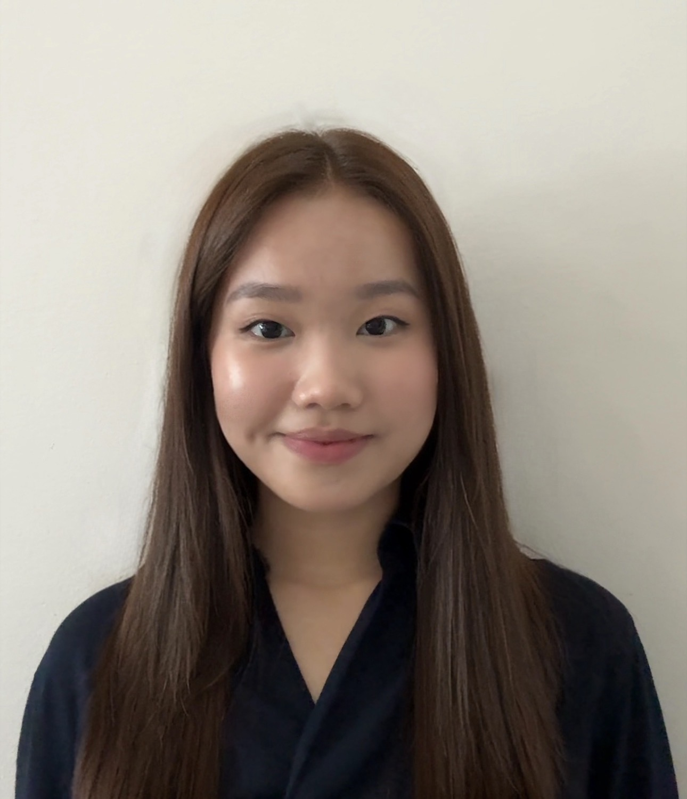

{width=150px style="border-radius:50%;"}

# Jesslyn Evangelista  

**B.S. in Statistics and Data Science**  
Minor in Data Science Engineering  
University of California, Los Angeles (UCLA)  

*Expected Graduation: June 2026*

---

## About Me

Hi, my name is Jesslyn Evangelista. I am currently majoring in Statistics and Data Science at UCLA, with a minor in Data Science Engineering. I have strong interests in data analysis, machine learning, and statistical modeling. I enjoy working with data to uncover insights and build models that help solve real-world problems. I am an eager and quick learner, who is always excited to explore new tools and technologies in data science.

This website showcases my **projects, experience, and technical skills**.

## Areas of Interest

- Data Science  
- Machine Learing
- Statistical Modeling  
- Data Visualization

## Explore My Work

- [Projects](projects.qmd)
- [Experience](experience.qmd)
- [About](about.qmd)
- [Contact](contact.qmd)